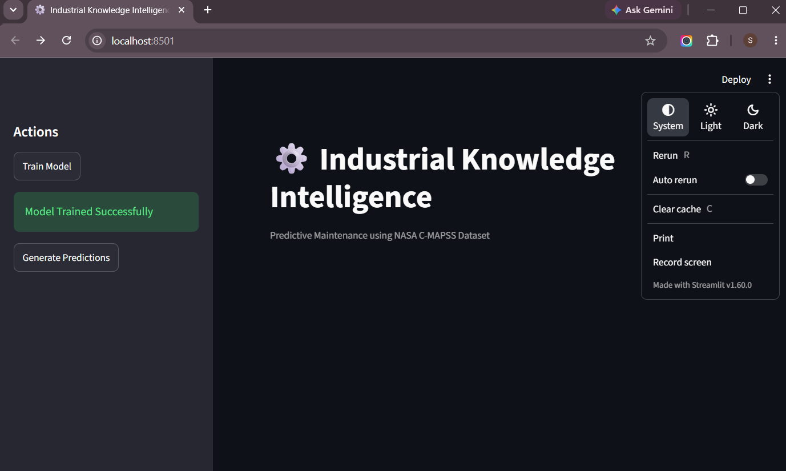
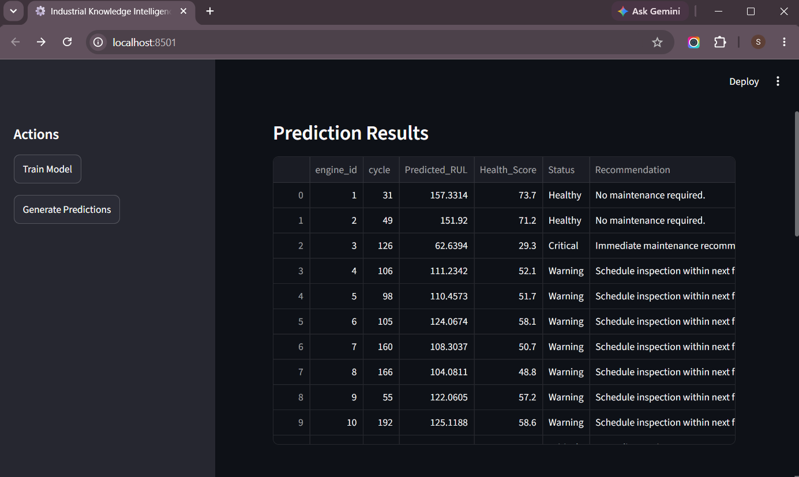

# ⚙️ Industrial Asset Health Monitoring & Predictive Maintenance

An Industrial Predictive Maintenance System developed using the **NASA C-MAPSS Turbofan Engine Dataset**. The application estimates the **Remaining Useful Life (RUL)** of engines and provides maintenance recommendations based on their health status.

---

## Project Overview

Unexpected equipment failures can lead to costly downtime and safety risks in industrial environments. This project applies machine learning to analyze engine sensor data and estimate the remaining operational life of an engine.

The predicted Remaining Useful Life (RUL) is further converted into an easy-to-understand health score and maintenance recommendation, allowing maintenance teams to prioritize inspections and servicing.

---

## Features

- Predict Remaining Useful Life (RUL)
- Engine Health Score Calculation
- Engine Status Classification
- Maintenance Recommendation System
- Interactive Streamlit Dashboard
- XGBoost Regression Model
- Data Preprocessing & Feature Scaling

---

## Tech Stack

| Category | Technology |
|----------|------------|
| Language | Python |
| Data Processing | Pandas, NumPy |
| Machine Learning | XGBoost, Scikit-learn |
| Visualization | Streamlit |
| Model Saving | Joblib |

---

## Dataset

NASA C-MAPSS Turbofan Engine Degradation Simulation Dataset

The dataset contains:

- Engine ID
- Cycle Number
- Operational Settings
- 21 Sensor Measurements
- Remaining Useful Life (RUL)

---

## Project Structure

```text
Industrial-Knowledge-Intelligence/

│
├── data/
│
├── models/
│
├── src/
│   ├── dataset.py
│   ├── model.py
│   ├── predictor.py
│   └── maintenance.py
│
├── app.py
├── requirements.txt
└── README.md
```

---

## Workflow

```
NASA Dataset
      │
      ▼
Data Preprocessing
      │
      ▼
Feature Scaling
      │
      ▼
Train XGBoost Model
      │
      ▼
Predict Remaining Useful Life
      │
      ▼
Health Score Calculation
      │
      ▼
Maintenance Recommendation
      │
      ▼
Interactive Dashboard
```

---

## Installation

Clone the repository

```bash
git clone https://github.com/your-username/Industrial-Knowledge-Intelligence.git
```

Move into the project

```bash
cd Industrial-Knowledge-Intelligence
```

Install dependencies

```bash
pip install -r requirements.txt
```

---

## Running the Project

Launch the Streamlit application

```bash
streamlit run app.py
```

---

## Output

The dashboard provides:

- Predicted Remaining Useful Life
- Engine Health Score
- Engine Status
- Maintenance Recommendation

Website
## 📸 Application Screenshots

### Home Page



### Prediction Results



---

## Future Improvements

- Real-time sensor data integration
- Predictive maintenance scheduling
- Feature importance visualization
- Historical trend analysis
- Cloud deployment

---

## Author

**Shaleth Ghosh** & 
**Yashaswini Singh**

Engineering Physics  
Indian Institute of Technology (BHU), Varanasi

---

## License

This project is developed for educational and research purposes.
